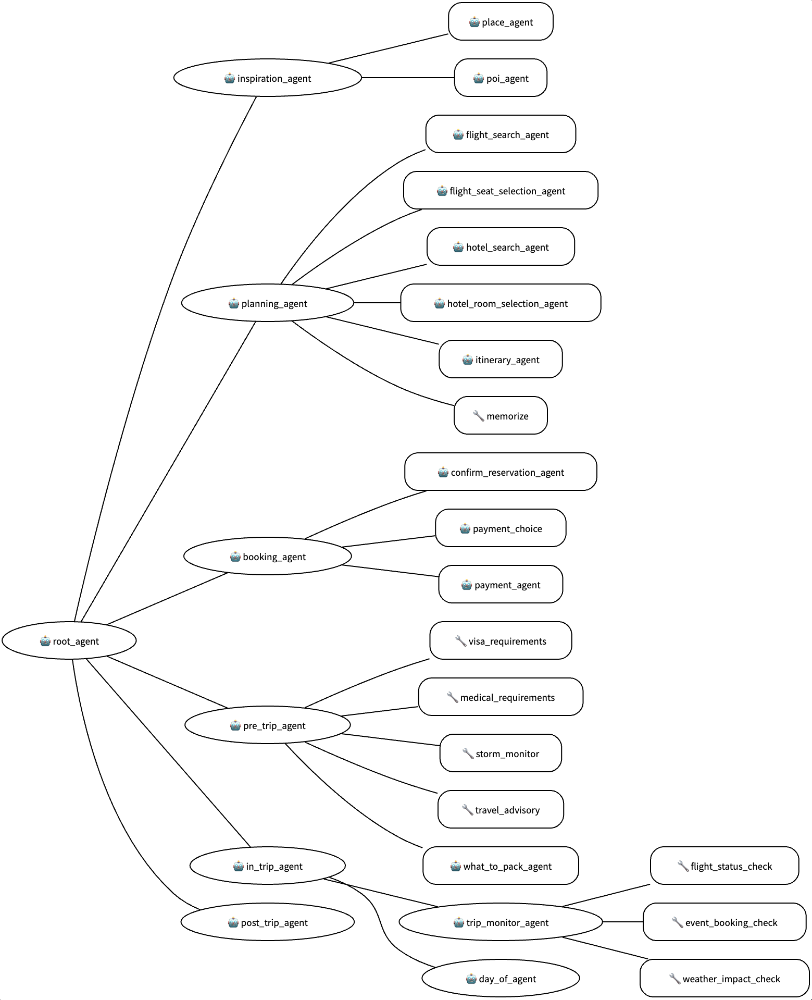

# ✈️🏨 Travel Concierge Agent (ADK + Multi-Agent + Maps + MCP)

[](https://www.python.org/)
[](https://github.com/google/adk-python)
[](LICENSE)

## 🎯 Executive Summary
The **Travel Concierge Agent** is a next-generation travel assistant designed to manage the entire traveler lifecycle—from initial inspiration and planning to post-trip feedback. It demonstrates a complex multi-agent architecture where specialized agents handle distinct stages of travel, ensuring a personalized and high-touch user experience.

By integrating **Google Maps Grounding**, **Google Search**, and external **MCP tools (e.g., Airbnb)** via the **Agent Development Kit (ADK)**, it provides real-world utility that goes far beyond simple chatbot capabilities. This is a premier template for travel agencies, airlines, and hospitality groups looking to deploy hyper-personalized AI assistants.

---

## 🏗️ Technical Architecture
The system employs a **state-aware multi-agent cohort** where agents share a common "Traveler Profile" and "Itinerary" state:

### The Concierge Team:
- **Inspiration Agent**: Suggests destinations based on vague user "vibes" or specific criteria.
- **Planning Agent**: Coordinates flight, hotel, and activity selection into a structured itinerary.
- **Booking Agent**: Manages the payment and reservation flow (simulated/pluggable).
- **In-Trip Agent**: Provides real-time assistance, transit info, and guided tours during the trip.
- **Post-Trip Agent**: Extracted preferences from the experience to refine future recommendations.



---

## 🔄 Workflow Logic
1.  **Pre-Booking**: Inspiration -> Destination Choice -> Flight/Hotel Search -> Itinerary Generation.
2.  **Post-Booking**: Visa/Medical Requirements -> Packing Lists -> Storm Monitoring.
3.  **In-Trip**: "Day-Of" assistance using Google Maps to get from Point A to Point B.
4.  **Closing the Loop**: Post-trip interview to update user preferences in the master profile.

---

## 🤝 Platform Integrations

### **Gemini Enterprise Integration**
This agent can be registered as a primary concierge service in **Gemini Enterprise**. It allows employees to plan and book business travel within the corporate security framework, while leveraging custom enterprise flight/hotel policy tools.

### **Model Context Protocol (MCP)**
Includes a dedicated integration with the **Airbnb MCP Server**, allowing the planning agent to search for real listings without needing custom API logic for every platform.

---

## 🔌 API & Local Deployment

### **Local Run**
```bash
uv run adk run travel_concierge
```

### **Programmatic Access**
```python
import vertexai
from vertexai import agent_engines

# Access the Concierge
agent = agent_engines.get("5068731011861315584") # Example ID
response = agent.query(input="Suggest some activities around Baa Atoll")
```

---

## 🚀 Getting Started

### **1. Installation**
```bash
git clone https://github.com/bdelph79/Travel-Concierge.git
cd Travel-Concierge
uv sync
```

### **2. Configuration**
Create a `.env` file:
```env
GOOGLE_CLOUD_PROJECT=gemini-enterprise-496008
GOOGLE_CLOUD_LOCATION=us-east1
GOOGLE_CLOUD_STORAGE_BUCKET=travel-concierge-496008
GOOGLE_MAPS_API_KEY=your_maps_key
```

---

## 📝 Prerequisites Checklist
- [ ] **Google Cloud Project**: With Vertex AI and Maps Grounding APIs enabled.
- [ ] **Maps API Key**: Required for geocoding and location-aware tools.
- [ ] **Python 3.11+**: Managed by `uv`.

---
## Disclaimer
This agent sample is provided for illustrative purposes only. Users are responsible for any further development, testing, security hardening, and deployment of agents based on this sample.

---

## Global Prerequisites for All Projects

To deploy and run these agents, ensure you have the following set up:

1.  **Google Cloud Project**: An active GCP project with billing enabled.
2.  **Authentication**: 
    - Install the [Google Cloud SDK](https://cloud.google.com/sdk/docs/install).
    - Run `gcloud auth application-default login` to authenticate locally.
3.  **APIs Enabled**:
    - Vertex AI API (`aiplatform.googleapis.com`)
    - Cloud Storage API (`storage.googleapis.com`)
4.  **Environment Variables**: Create a `.env` file in the root of each project with the following:
    ```env
    GOOGLE_CLOUD_PROJECT=your-project-id
    GOOGLE_CLOUD_LOCATION=us-central1
    GOOGLE_CLOUD_STORAGE_BUCKET=your-bucket-name
    ```
5.  **Python Environment**: Python 3.10+ and [uv](https://docs.astral.sh/uv/getting-started/installation/) installed for dependency management.
